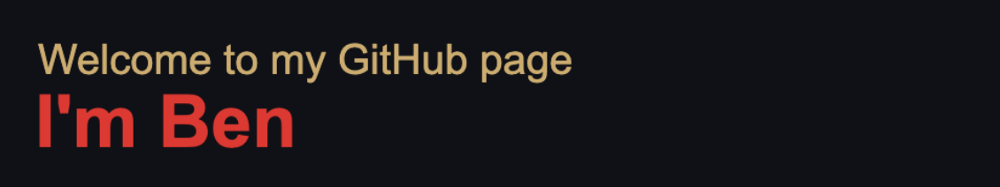

<!--  -->
 

## About Me 
⛰️ I work from the serene landscapes of rural Virginia. 

👨‍👩‍👧
I have a loving family, which includes my wonderful wife, two daughters, and a lively menagerie of five cats and three dogs.

🎮
 I'm an avid gamer, drawn to games that allow me to build and engage in theorycrafting. 

💪
 I pretend I can get back into shape using a peloton and free weight gym. 

👨‍💻
  I have been addicted to writing code and learning new frameworks in building software for the last 20 years. 

## 
Currently, I'm honing my programming skills, particularly in cloud development, after a brief hiatus. I'm cautiously optimistic about the transformative impact of AI-driven technology on our lives. 

###  My Interests

 Feel free to connect with me; I'd be delighted to engage with fellow tech enthusiasts like you.

I euphoria and frustrations that come with being directly involved with designing software. I am sure I will update this space 
more with new projects and endeavors. 

I like to keep my profile pic updated with art from my 11 year old daughter (who seems to have a knack for digital art) below is the archive of photos that have been on 
display. 
###  
*Jan*

*Feb*

*March* 

*April* 

<!--
**ben-of-codecraft/ben-of-codecraft** is a ✨ _special_ ✨ repository because its `README.md` (this file) appears on your GitHub profile.

Here are some ideas to get you started:

- 🔭 I’m currently working on ...
- 🌱 I’m currently learning ...
- 👯 I’m looking to collaborate on ...
- 🤔 I’m looking for help with ...
- 💬 Ask me about ...
- 📫 How to reach me: ...
- 😄 Pronouns: ...
- ⚡ Fun fact: ...
-->
