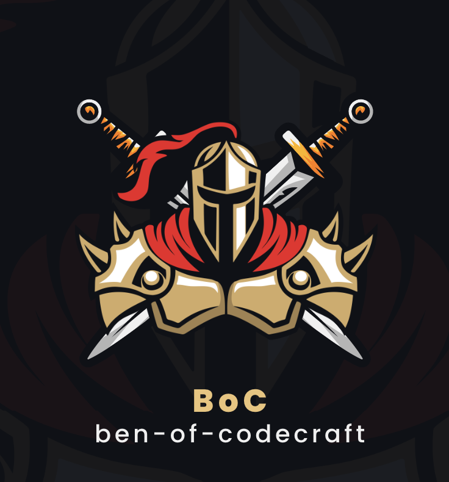
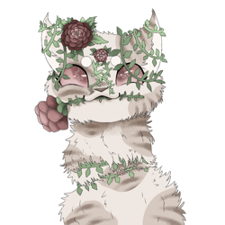
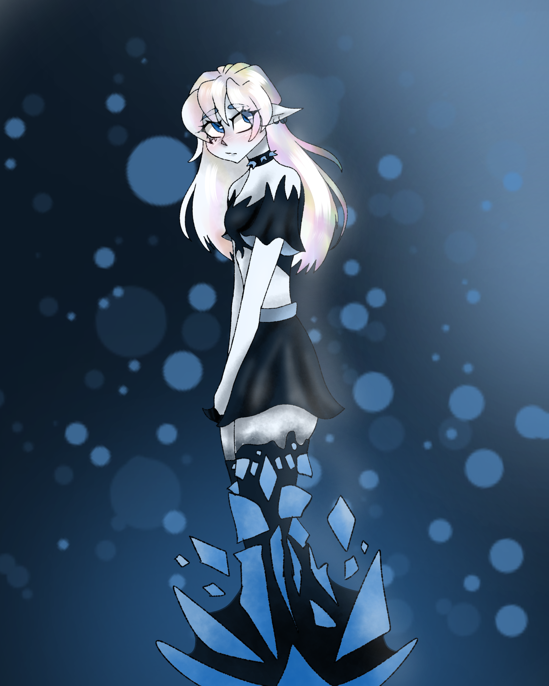
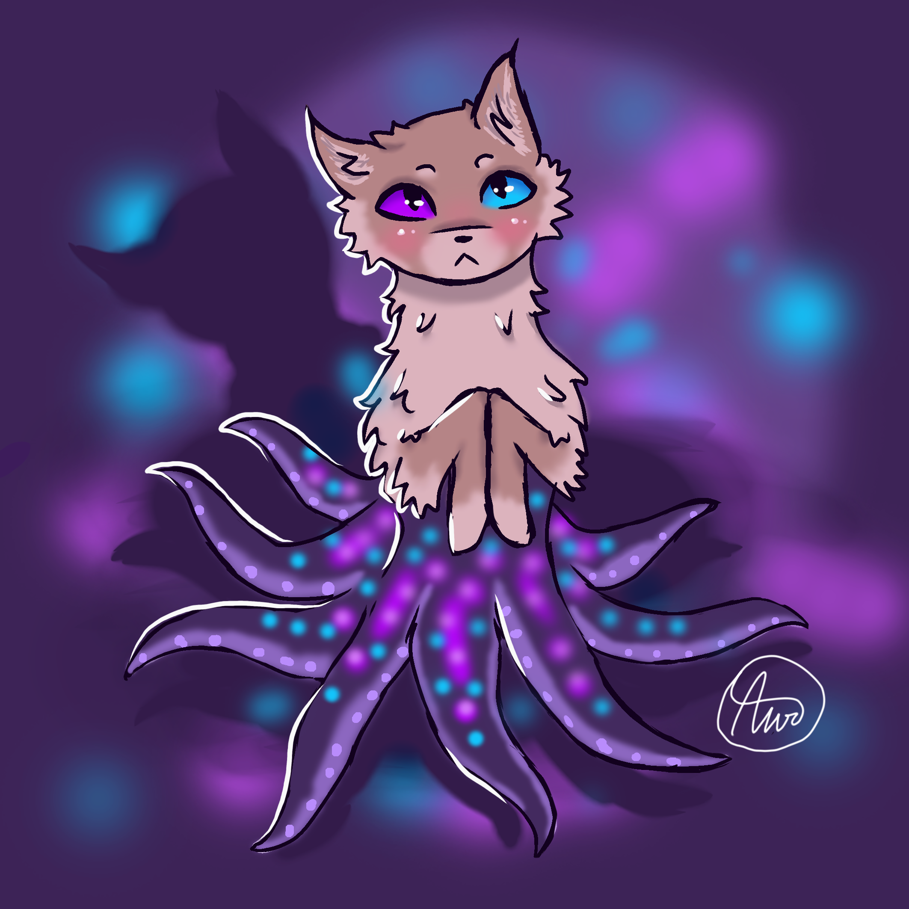

## Hi, I am Ben 

⛰️ I work from the serene landscapes of rural Virginia. 

👨‍👩‍👧 I have a loving family, which includes my wonderful wife, two daughters, and a lively menagerie of six cats and two dogs.

🎮 I'm an avid gamer, drawn to games that allow me to build and engage in theorycrafting. 

💪 I pretend I can get back into shape using a peloton and free weight gym. 

👨‍💻  I love writing code and tinkering with random open source projects.  

  
## Archive of GitHub Profile
I update my GH profile pic with art from my 12 year old daughter (who seems to have a knack for digital art) below is the archive of photos that have been used. 

| *Jan* | *Feb* | *Mar* |
| --- | --- | --- |
|  |      |     |
| *April* | *May* | *June* |
|  |      |     |

 

