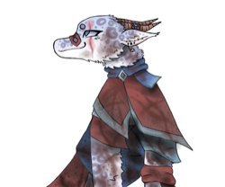

## Hi, I am Ben 

⛰️ I work from the serene landscapes of rural Virginia. 

👨‍👩‍👧 with my wonderful wife, two daughters, and two dogs.

🮠I'm an avid gamer and game modder actively building on World of Warcraft Mods

👨‍💻  I love writing code and working on open source projects, especiall with TypeScript.  

<!-- my-badges start -->
<!-- my-badges end -->

  
## Archive of GitHub Profile
I update my GH profile pic with art from my 12 year old daughter (who seems to have a knack for digital art) below is the archive of photos that have been used. 

### 2024

|  

| *Jan* | *Feb* | *Mar* |
| --- | --- | --- |
|  |      |     |
| *April* | *May* | *June* |
|  |      |     |

 

