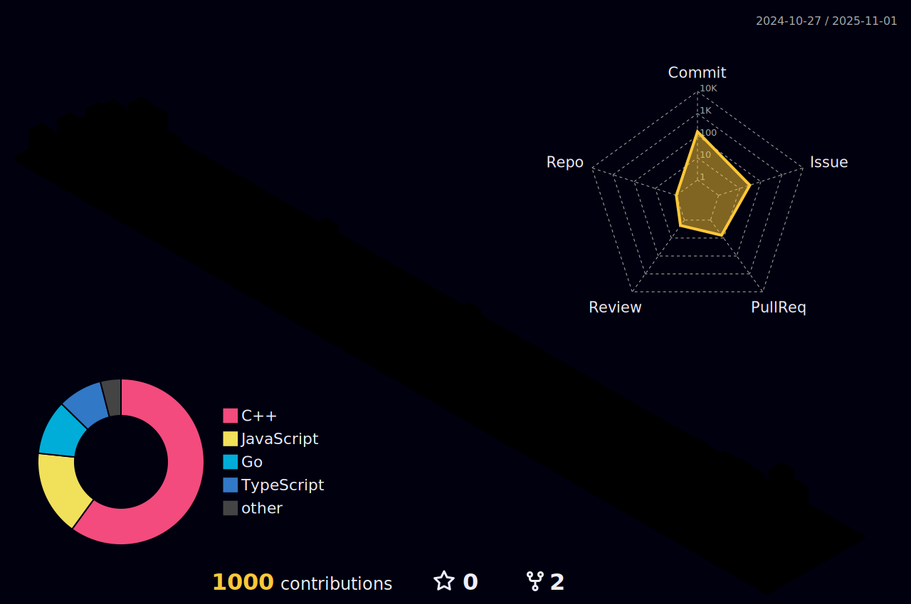

## Hi, I am Ben 

⛰️ I work from the serene landscapes of rural Virginia. 

👨‍👩‍👧 with my wonderful wife, two daughters, and two dogs.

🮠I'm an avid gamer and game modder actively run and build custom open source content for World of Warcraft Servers.

👨‍💻  I love writing code and working on open source projects, especially in Go

## My active projects

* Owner of [Araxia Online Open Source Game Projects](https://github.com/araxiaonline)
* [https://araxiaonline.github.io/docs/#/](https://araxiaonline.github.io/docs/#/)

<!-- my-badges start -->

<!-- my-badges end -->

 

