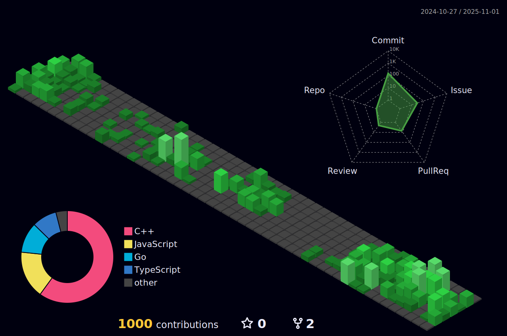

## Hi, I am Ben 

⛰️ I work from the serene landscapes of rural Virginia. 

👨‍👩‍👧 with my wonderful wife, two daughters, and two dogs.

🮠I'm an avid gamer and game modder actively building new modules for World of Warcraft Servers.

👨‍💻  I love writing code and working on open source projects, especially with TypeScript.  

<!-- my-badges start -->
<h4><a href="https://github.com/my-badges/my-badges">My Badges</a></h4>

<!-- my-badges end -->

  
## Archive of GitHub Profile
I update my GH profile pic with art from my 12 and 10 year old daughters (who seems to have a knack for digital art) below is the archive of photos that have been used. 

### 2024
<table>
  <tr>
    <td align="center">
      
    </td>
    <td align="center">
      
    </td>
    <td align="center">
      <!-- Third image goes here -->
    </td>
  </tr>
</table>

### 2023
<table>
  <tr>
    <td align="center">
      
    </td>
    <td align="center">
      
    </td>
    <td align="center">
      
    </td>
  </tr>
  <tr>
    <td align="center">
      
    </td>
    <td align="center">
      
    </td>
    <td align="center">
      
    </td>
  </tr>
</table>

 
